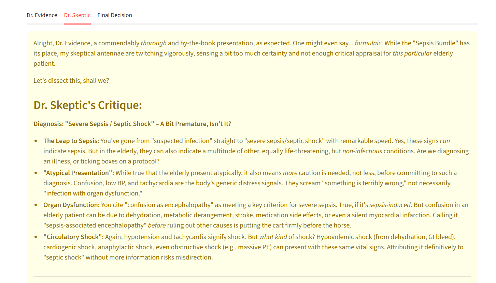
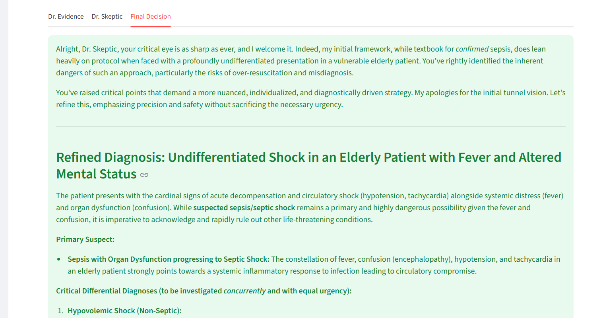

# AI Clinical Decision Support System (CDSS)

A multi-agent AI system that simulates structured clinical reasoning using three specialized virtual medical roles. By mimicking a multidisciplinary team, the system analyzes patient cases, critiques reasoning in real-time, and produces refined diagnostic insights using the Google Gemini model.

> [!IMPORTANT]
> **Disclaimer:** This project is for educational and research purposes only. It is not intended for use in clinical diagnosis or direct patient care.

---


##  System Architecture

The system follows a modular, layered architecture to ensure a clear separation of concerns between the user interface, agent logic, and the LLM provider.

* **User Interface:** A Streamlit-based web dashboard.
* **Orchestration:** A central controller managing the "hand-offs" between different AI personas.
* **Agent Logic:** Specialized prompts that define the clinical roles.
* **Provider Layer:** Interface for API communication and JSON schema enforcement.

---

##  Medical Agent Roles

The core of the system is the interaction between three distinct AI agents:

| Agent | Role | Responsibility |
| :--- | :--- | :--- |
| **Dr. Evidence** | Clinical Analyst | Identifies likely conditions, highlights key clinical findings, and proposes initial management. |
| **Dr. Skeptic** | Peer Reviewer | Acts as a "Devil's Advocate." Highlights reasoning weaknesses, suggests missing data, and proposes alternatives. |
| **Final Decision** | Lead Consultant | Integrates findings from both Evidence and Skeptic agents to produce a refined diagnosis and confidence score. |

---

##  How the Code Works

### `app.py` — Frontend Interface
This is the Streamlit entry point and user interaction layer. It collects the patient case input, calls medical_debate(case) from conversation.py, and renders outputs in separate tabs for Evidence, Skeptic, and Final decisions. It does not perform reasoning — only input handling and result visualization.

### `conversation.py` — Orchestration Layer
This file controls the reasoning pipeline through the function medical_debate(case). It sequentially calls evidence_agent(), skeptic_agent(), and final_agent() from agents.py, passing outputs forward at each step. The final structured result is returned to app.py for display.

### `agents.py` — AI Personas
Defines the three role-specific functions: evidence_agent(case), skeptic_agent(case, evidence_output), and final_agent(case, evidence, skeptic). Each function builds a role-specific prompt and calls ask_llm() from llm_provider.py. This file encapsulates clinical reasoning roles but does not directly manage API communication.
### `llm_provider.py` — Model Interface
Contains the function ask_llm(prompt), which sends formatted prompts to the Google Gemini API. It enforces structured JSON responses and handles API authentication. All agent functions rely on this file for LLM communication

### `main.py` — API Endpoint (Optional)
Implements a FastAPI route that exposes the system via REST. The endpoint receives a case, calls medical_debate(case) from conversation.py, and returns the full agent output as JSON. This allows integration outside Streamlit.

---

## 🛠 Technologies Used

* **Language:** Python
* **Frontend:** Streamlit
* **Backend:** FastAPI (Optional)
* **LLM:** Google Gemini API
* **Data Handling:** Pydantic (for JSON validation)

---

##  Getting Started

1. **Clone the repository:**
   ```bash
   git clone [https://github.com/arnav-ds/ai-clinical-support.git](https://github.com/arnav-ds/ai-clinical-support.git)
2. **Install dependencies:**
   ```bash
   pip install -r requirements.txt
3. **Set up your API Key:** Create a .env file in the root directory and add your Google Gemini key:
    ```bash
    GEMINI_API_KEY=your_key_here
4. **Run the application:**
   ```bash
   streamlit run app.py

 ## Data Flow

User Input -> Evidence Agent -> Skeptic Agent -> Final Agent -> UI






